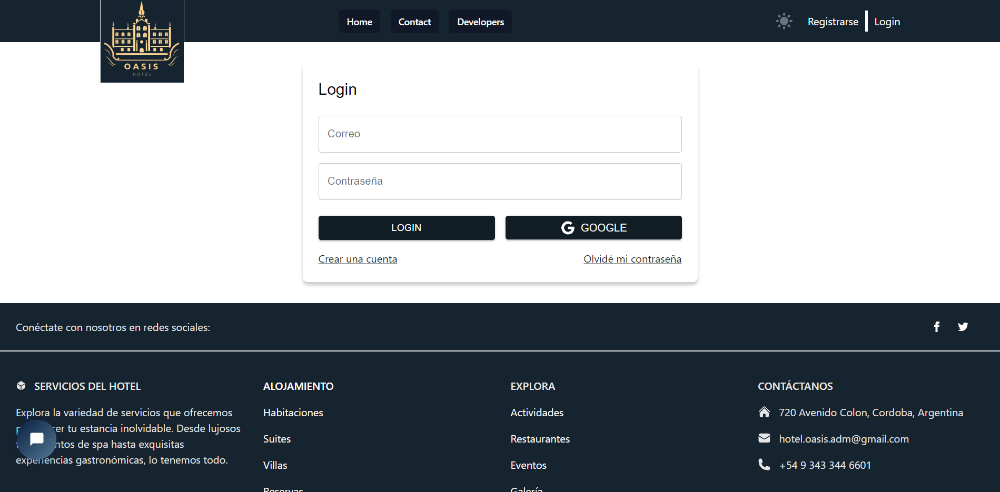
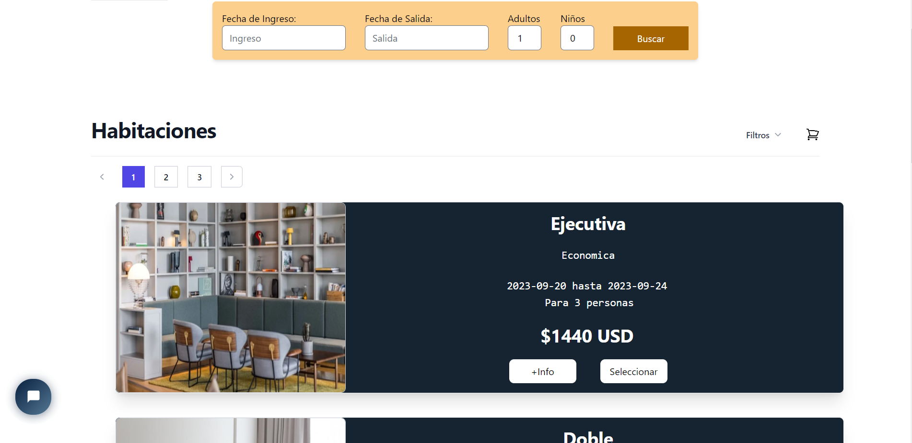
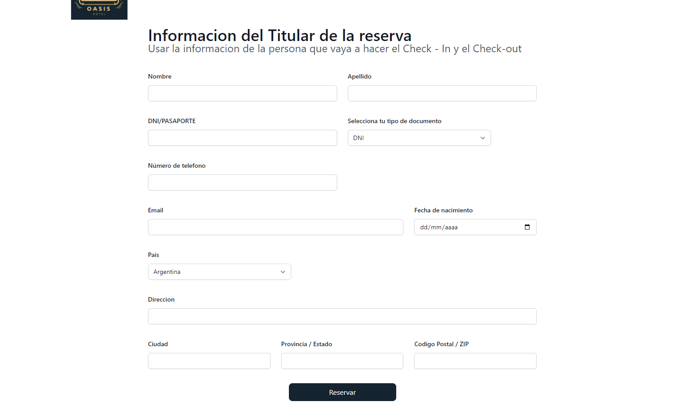
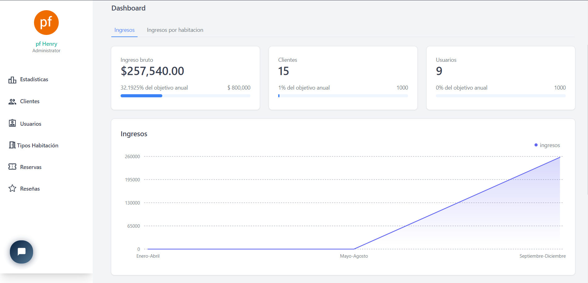
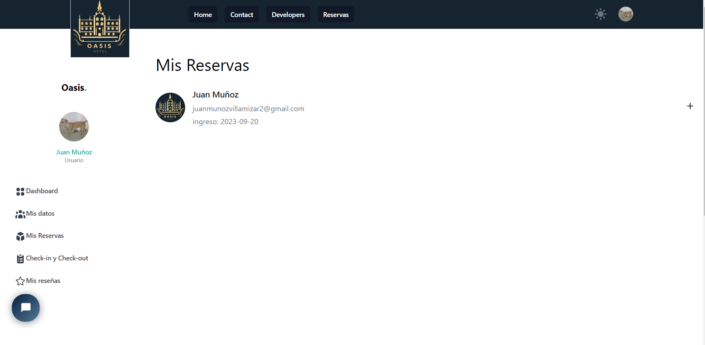

# Hotel Oasis Booking Website

Este proyecto es una página web full stack desarrollada como proyecto final en el bootcamp SoyHenry.com: Se trata de una plataforma de reservas de hotel que utiliza las tecnologías aprendidas durante el programa.

## Características Principales

<table>
  <tr>
    <td width="50%">
      <strong>Autenticación de Usuario</strong> 
      Los usuarios pueden registrarse e iniciar sesión en la plataforma para acceder a su cuenta y posteriormente hacer reservas.
    </td>
    <td width="50%">
      
    </td>
  </tr>
  <tr>
    <td width="50%">
      <strong>Búsqueda de Hoteles</strong> 
      Los usuarios pueden buscar hoteles según sus preferencias, incluyendo la fecha de ingreso y de salida, el número de huéspedes (adultos y niños) y pueden elegir entre diferentes tipos de habitaciones, cada una con sus respectivos precios.
    </td>
    <td width="50%">
      
    </td>
  </tr>
  <tr>
    <td width="50%">
      <strong>Reservas y pagos con Mercado pago</strong> 
      Los usuarios pueden crear y gestionar sus reservas en el hotel, seleccionando habitaciones y fechas disponibles, finalmente hacer el respectivo pago de la reserva por medio de mercado pago.
    </td>
    <td width="50%">
      
    </td>
  </tr>
  <tr>
    <td width="50%">
      <strong>Dashboard de Administrador</strong> 
      Los administradores tienen acceso a un panel de control especial para gestionar la información del hotel, incluyendo la disponibilidad de habitaciones y la visualización de reservas.
    </td>
    <td width="50%">
      
    </td>
  </tr>
  <tr>
    <td width="50%">
      <strong>Dashboard de Usuario</strong> 
      Los usuarios pueden ver y gestionar sus reservas, crear reseñas, así como actualizar su información personal.
    </td>
    <td width="50%">
      
    </td>
  </tr>
</table>

## Tecnologías Utilizadas

Este proyecto fue desarrollado utilizando las siguientes tecnologías:

- **Frontend: React, Redux, HTML, CSS,TailWind UI**
- **Backend: Node.js, Express.js**
- **Base de Datos: PostgreSQL, Sequelize ORM**
- **Autenticación: Firebase**

## Objetivo

El objetivo de este proyecto es proporcionar a los usuarios una plataforma intuitiva y fácil de usar para realizar reservas de hotel de manera eficiente, brindando a los administradores las herramientas necesarias para gestionar el hotel de manera efectiva.

¡Esperamos que disfrutes explorando y utilizando esta plataforma de reservas de hotel!
